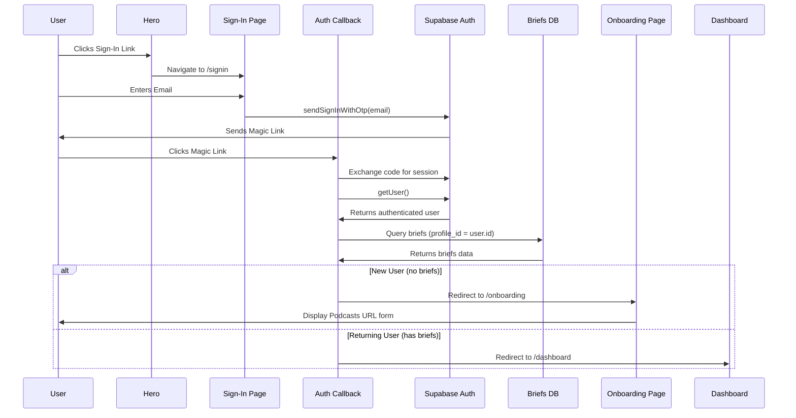

# Magic Link Signin + Onboarding Page Implementation Plan

## Overview

Simplify the signin page to magic link only (remove Google OAuth), add smart redirect logic after auth so new users land on an onboarding page, and build the onboarding page UI with an Apple Podcasts URL input.

## Current State Analysis

- `/app/signin/page.js` — has both Google OAuth button and magic link form
- `/app/api/auth/callback/route.js` — always redirects to `config.auth.callbackUrl` (`/dashboard`) after session exchange
- No `/app/onboarding/` page exists
- No application code queries the `briefs` table yet
- `briefs` table has `profile_id` FK with RLS scoped to `auth.uid() = profile_id` — supports a simple count query

## Desired End State

- `/signin` shows only the magic link form
- After magic link click: new users (0 briefs) → `/onboarding`, returning users → `/dashboard`
- `/onboarding` is auth-gated, shows Apple Podcasts URL input form (UI only, no submission logic)




## Security Model

**Redirect**: The browser follows the magic link, which hits `/api/auth/callback` on the server. That route sets the session cookie and decides where to send the user. Entirely server-side — the frontend just receives the final redirect destination.

**Data isolation**: Two layers enforce it:

1. **Session cookie** — Supabase sets an httpOnly cookie after `exchangeCodeForSession`. Every subsequent request includes this cookie. The server-side Supabase client reads it to identify the user. Cannot be faked or swapped.

2. **Row Level Security (RLS)** — every table (`briefs`, `credit_ledger`, `brief_email_deliveries`) has Postgres policies like `auth.uid() = profile_id`. Even if someone crafted a malicious query, Postgres rejects any rows where the authenticated user's ID doesn't match. Enforced at the DB level, not just the app level.

## What We're NOT Doing

- Google OAuth (removed entirely)
- Form submission / brief creation on onboarding page
- Processing pipeline integration
- Onboarding completion redirect logic (that comes when brief submission is built)

---

## Phase 1: Magic Link Only Signin Page

### Overview
Remove the Google OAuth button and divider from `/app/signin/page.js`, leaving only the magic link email form.

### Changes Required:

#### 1.1 Signin Page

**File**: `app/signin/page.js`
**Changes**: Remove `handleSignup` oauth branch, Google button, and divider. Keep only the magic link form. Simplify `handleSignup` to only handle `magic_link` type (or just inline it directly since there's only one auth method now).

```js
// Remove:
// - Google OAuth button (lines 76-110)
// - <div className="divider ..."> (lines 112-114)
// - type === "oauth" branch in handleSignup (lines 26-32)
// - const { type, provider } = options destructuring → just use email directly

// Result: a simple page with heading + email input + "Send Magic Link" button
```

### Success Criteria:

#### Automated Verification:
- [ ] `npm run build` passes with no errors

#### Manual Verification:
- [ ] `/signin` shows only the email input and "Send Magic Link" button
- [ ] No Google button visible
- [ ] Entering an email and submitting sends a magic link email via Resend

---

## Phase 2: Smart Redirect After Auth Callback

### Overview
How the magic link email → app redirect works:

1. On `/signin`, `signInWithOtp` is called with `emailRedirectTo: window.location.origin + "/api/auth/callback"`. This tells Supabase where to send the user after they click the link.
2. Supabase emails the user a link in the form: `https://yourapp.com/api/auth/callback?code=XXXX`
3. User clicks the link in their email — their browser hits `/api/auth/callback?code=XXXX`
4. The callback route calls `exchangeCodeForSession(code)` to establish a Supabase session (sets the auth cookie)
5. It then checks brief count and redirects to `/onboarding` (0 briefs) or `/dashboard` (has briefs)

This means the "redirect to the right page" logic lives entirely in `/api/auth/callback` — there's nothing special needed in the email or on Supabase's side beyond whitelisting the callback URL.

After exchanging the auth code for a session, query whether the user has any briefs. Redirect new users to `/onboarding`, returning users to `/dashboard`.

### Changes Required:

#### 2.1 Auth Callback Route

**File**: `app/api/auth/callback/route.js`
**Changes**: After `exchangeCodeForSession`, get the user, query `briefs` count (limit 1), redirect accordingly.

```js
import { createClient } from "@/libs/supabase/server";
import { NextResponse } from "next/server";

export const dynamic = "force-dynamic";

export async function GET(req) {
  const requestUrl = new URL(req.url);
  const code = requestUrl.searchParams.get("code");
  const supabase = await createClient();

  if (code) {
    await supabase.auth.exchangeCodeForSession(code);
  }

  const { data: { user } } = await supabase.auth.getUser();

  if (user) {
    // Use .select + .limit(1) instead of count — simpler and avoids COUNT(*) scan
    // If the query fails, data will be null and we fall through to /dashboard (acceptable default)
    const { data } = await supabase
      .from("briefs")
      .select("id")
      .eq("profile_id", user.id)
      .limit(1);

    if (data?.length === 0) {
      return NextResponse.redirect(new URL("/onboarding", requestUrl.origin));
    }
  }

  // Fallback: no user (bad/missing code) → /dashboard, which bounces to /signin via layout guard
  return NextResponse.redirect(new URL("/dashboard", requestUrl.origin));
}
```

### Success Criteria:

#### Automated Verification:
- [ ] `npm run build` passes with no errors

#### Manual Verification:
- [ ] New user clicking magic link lands on `/onboarding`
- [ ] Returning user (with existing briefs) clicking magic link lands on `/dashboard`

---

## Phase 3: Onboarding Page

### Overview
Create an auth-gated `/onboarding` route with a layout guard and a page that prompts the user to enter an Apple Podcasts URL. UI only — no submission logic.

### Changes Required:

#### 3.1 Onboarding Layout (Auth Guard)

**File**: `app/onboarding/layout.js`
**Changes**: Mirror the pattern from `app/dashboard/layout.js` — server component that checks auth and redirects to `/signin` if not logged in.

```js
import { createClient } from "@/libs/supabase/server";
import { redirect } from "next/navigation";
import config from "@/config";

export default async function OnboardingLayout({ children }) {
  const supabase = await createClient();
  const { data: { user } } = await supabase.auth.getUser();

  if (!user) {
    redirect(config.auth.loginUrl);
  }

  return <>{children}</>;
}
```

#### 3.2 Onboarding Page

**File**: `app/onboarding/page.js`
**Changes**: Client component with two visible steps. Step 1 is active (URL input). Step 2 is shown as a future step ("Check your inbox").

```js
"use client";

import { useState } from "react";
import config from "@/config";

export default function OnboardingPage() {
  const [url, setUrl] = useState("");

  return (
    <main className="min-h-screen flex flex-col items-center justify-center p-8" data-theme={config.colors.theme}>
      <div className="max-w-xl w-full space-y-10">
        <h1 className="text-3xl font-extrabold tracking-tight text-center">
          Let&apos;s get started
        </h1>

        {/* Step 1 */}
        <div className="space-y-4">
          <p className="text-lg font-semibold">Step 1: Enter an Apple Podcasts URL</p>
          <input
            type="url"
            value={url}
            onChange={(e) => setUrl(e.target.value)}
            placeholder="https://podcasts.apple.com/..."
            className="input input-bordered w-full"
          />
          <button className="btn btn-primary btn-block" disabled>
            Generate Brief
          </button>
        </div>

        {/* Step 2 */}
        <div className="opacity-50 space-y-2">
          <p className="text-lg font-semibold">Step 2: Check your inbox</p>
          <p className="text-base-content/70">
            Your brief will arrive in about a minute in your email inbox.
          </p>
        </div>
      </div>
    </main>
  );
}
```

### Success Criteria:

#### Automated Verification:
- [ ] `npm run build` passes with no errors

#### Manual Verification:
- [ ] Unauthenticated visit to `/onboarding` redirects to `/signin`
- [ ] Authenticated new user sees Step 1 (URL input) and Step 2 (dimmed)
- [ ] "Generate Brief" button is visible but disabled (submission not implemented yet)

---

## References

- Signin page: `app/signin/page.js`
- Auth callback: `app/api/auth/callback/route.js`
- Dashboard layout (auth guard pattern): `app/dashboard/layout.js`
- Briefs schema: `supabase/migrations/20260307133000_create_briefs_table.sql`

----

## CONFIDENCE SCORE (DO NOT EDIT)

- 9/10. Looks pretty solid, makes sense.

### QUIZ QUESTIONS 

**Q1 — A user signs up, creates 3 briefs, deletes their account, signs up again with the same email. Onboarding or dashboard?**
N/A for now (no delete feature exists), but account deletion is a future privacy/GDPR requirement worth a TODO.

**Q2 — The brief count query fails silently (data is null). Where does the user land? Is that the right fallback?**
Dashboard is the correct fallback. Onboarding is for confirmed new users only — if we can't confirm, assume returning. Sending a new user to dashboard just means an empty state, which is recoverable.

**Q3 — A user clicks the magic link but a session cookie already exists. What does exchangeCodeForSession do?**
Overwrites the existing session. Sequential, doesn't matter for this app. Worth a comment in the callback route explaining this for future reference.

**Q4 — What stops an authenticated returning user from navigating directly to /onboarding?**
Only brief count gates it. Known edge case: 0-brief returning user keeps seeing onboarding. Future fix: `skip_onboarding` boolean on profiles table. Acceptable for now.

**Q5 — Is it possible for the briefs query to run before the session is set, given the order of operations in the callback?**
No — await is sequential not concurrent. Order is guaranteed: exchange code → get user → query briefs. Session fully exists before briefs query runs.
